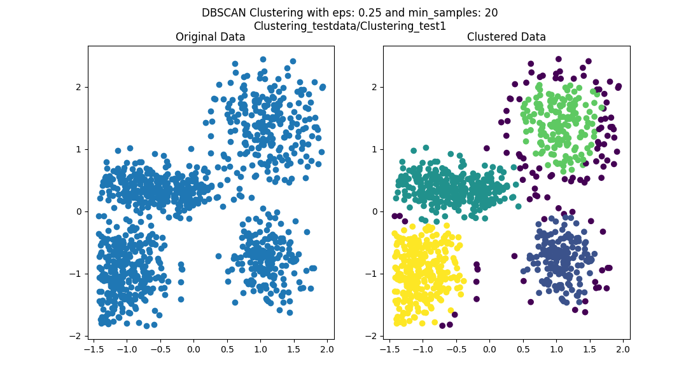

# Clustering

To run the program, see the [Usage](#Usage) section at the end of the document.

## Introduction

DBSCAN (Density-Based Spatial Clustering of Applications with Noise) is a clustering algorithm that groups together points that are closely packed together. It is also able to identify points that are outliers. The algorithm works by grouping together points that are within a certain distance of each other. The algorithm has two parameters: epsilon and minPts. Epsilon is the maximum distance between two points for them to be considered as in the same cluster. minPts is the minimum number of points required to form a cluster.

## Results

1. Clustering_testdata/Clustering_test1

   - eps=0.25
   - min_samples=20
   - clusters: 4 (without noise)
     

2. Clustering_testdata/Clustering_test2

   - eps=0.20
   - min_samples=20
   - clusters: 4 (without noise)
     

3. Clustering_testdata/Clustering_test3

   - eps=0.23
   - min_samples=20
   - clusters: 5 (without noise)
     
     This dataset is a bit more complex than the previous two datasets. I've tried to find the optimal values for epsilon and min_samples. This is the best result I could get.

4. Clustering_testdata/Clustering_test4

   - eps=0.26
   - min_samples=25
   - clusters: 2 (without noise)
   - 

5. Clustering_testdata/Clustering_test5
   - eps=0.265
   - min_samples=20
   - clusters: 2 (without noise)
     

## Final Output Format

### PNG file: {input_file}\_output.png

The output file is a PNG file that shows the clusters. The clusters are shown in different colors.

### text file: {input_file}\_output.txt

The text file contains the following information:

```
eps: {epsilon}, min_samples: {min_samples}
X Y ClusterID
```

## Usage

clone the repository and run the following command in the terminal:

```bash
git clone https://github.com/LittleFish-Coder/clustering.git
```

```bash
cd clustering
```

```bash
python nm6121030.py
```

add arguments to the command line to change the default values of the program.

- `--input` to change the input file (default: Clustering_testdata/Clustering_test1)
- `--eps` to change the epsilon value (default: 0.20)
- `--min_samples` to change the min_samples value (default: 20)

### Example

```bash
python nm6121030.py --input Clustering_testdata/Clustering_test2 --eps 0.25 --min_samples 20
```
